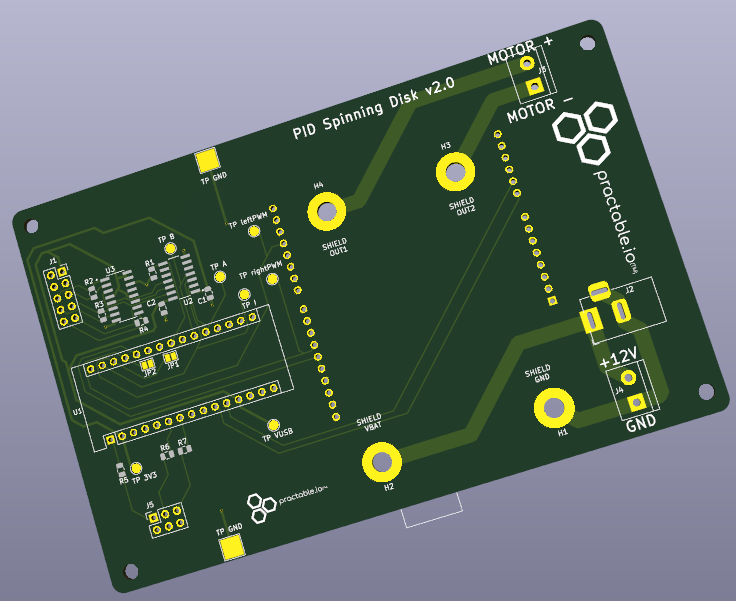
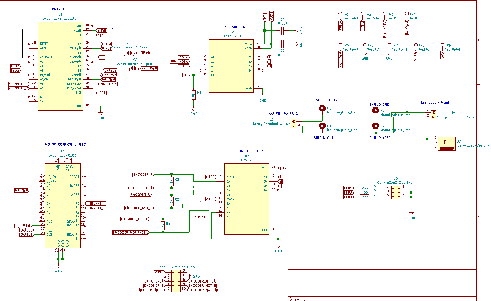

# Archived

The active repository can now be found [here](https://github.com/practable/spinner-amax/)

# Spinning disk remote lab PCB design

## Purpose

This is the current PCB used in the [Spinning Disk](https://github.com/practable/spinner-amax) remote laboratory.

## PCB

PIDController contains the KiCAD files for the current spinning disk remote lab PCB. Some additional component symbols/footprints are in the Additional Components folder (such as the nano 33 IoT footprint). 

## Possible updates to design

- integration of [custom microcontroller](https://github.com/timdrysdale/atmega-demo) rather than using separate Arduino Nano 33 IoT
- integration of custom motor driver?

